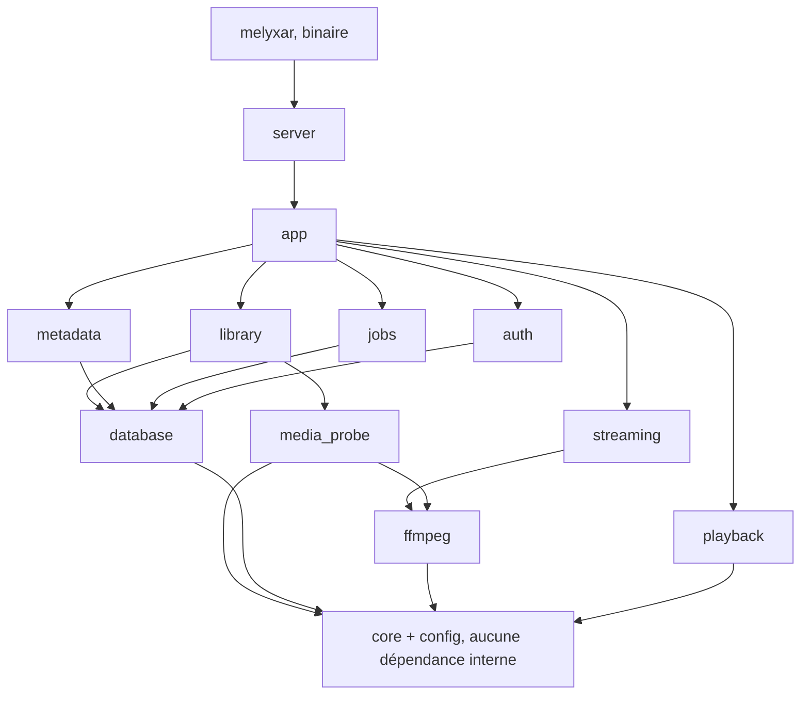
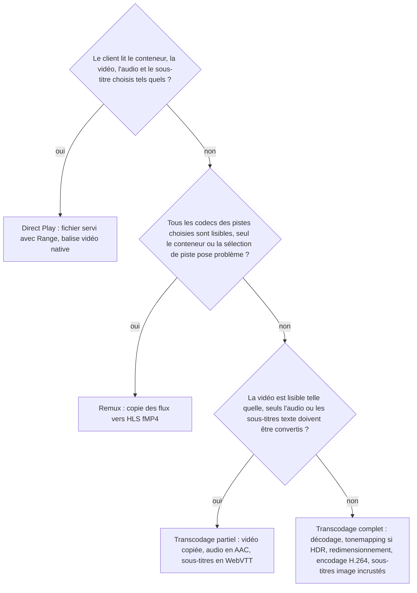

# Melyxar, revue d'architecture

Avis technique sur les fondations d'un serveur multimédia en Rust, pensé pour tourner dans un LXC Proxmox et servir d'abord un navigateur. Rédigé avant la première ligne de code, septembre 2026.

- Cible V0.1 : Linux, Brave/Chromium, films uniquement.
- Horizon : plusieurs années, complexité type Jellyfin.

> **Note.** La question de la base de données était laissée ouverte dans cette première revue. Elle a été tranchée ensuite en faveur de SQLite (voir [02-reactivite.md](02-reactivite.md) et le [README](README.md)). Le texte ci-dessous est conservé tel quel pour garder la trace du raisonnement.

## Verdict global

**Les fondations sont bonnes et cohérentes.** Rust, Axum, FFmpeg externe, HLS en fMP4, React côté client et monolithe modulaire forment une base à garder telle quelle. Elle ressemble beaucoup à ce que Jellyfin et Plex ont fini par adopter après des années d'errements, avec des outils plus sains.

Trois points méritent d'être ajustés avant la première ligne de code, parce qu'ils sont coûteux à changer ensuite : le **modèle de données** (séparer l'œuvre du fichier), la **façon dont le serveur pilote HLS** (le serveur possède la playlist, pas FFmpeg), et le **périmètre des briques autour de FFmpeg**. Le seul choix vraiment discutable était PostgreSQL.

| Choix | Verdict |
|---|---|
| 1. Rust côté serveur | Solide |
| 2. Axum et Tokio | Solide |
| 3. PostgreSQL dès le début | Discutable (tranché ensuite : SQLite) |
| 4. SQLx | Solide, sous condition |
| 5. FFmpeg en programme externe | Solide |
| 6. HLS et fMP4 | Solide |
| 7. hls.js | Solide |
| 8. React et TypeScript | Solide |
| 9. Monolithe modulaire | Solide |
| 10. Découpage en crates | À ajuster |

## 1. Lecture d'ensemble

### Le vrai problème d'un serveur multimédia n'est pas la base de données

Un serveur multimédia domestique gère quelques utilisateurs, quelques dizaines de milliers de fichiers au maximum et une poignée de lectures simultanées. La base ne sera jamais le goulot d'étranglement. Ce qui fait la différence entre un serveur agréable et un serveur pénible, c'est **le moteur de lecture** : savoir exactement ce que le client sait lire, ne transcoder que ce qu'il faut, gérer le seeking sans recharger, ne jamais laisser un FFmpeg orphelin.

### Direct Play sera rare, le remux sera la norme

Une bibliothèque de films typique est majoritairement en MKV. Chromium ne lit pas ce conteneur de façon fiable dans une balise `<video>`. Une grande partie des pistes audio (AC3, EAC3, DTS, TrueHD) n'est pas décodable par Chromium sous Linux. Le chemin « remux vers HLS fMP4 avec l'audio réencodé en AAC » sera le plus fréquent, bien avant le Direct Play. Il doit être le plus soigné de tous.

### Ce qu'il ne faut pas sous-estimer

Trois sujets structurent tout : le **modèle de données** (une œuvre n'est pas un fichier), le **profil de capacités du client** (le moteur de décision reçoit une description de ce que le client sait lire, il ne devine pas « c'est Brave »), et **l'identité des fichiers dans le temps** (un fichier renommé, déplacé ou remplacé ne doit pas faire perdre l'historique de lecture).

## 2. Les dix choix, un par un

### 2.1 Rust comme langage principal du backend (Solide)

**Solide.** Un serveur multimédia est avant tout un superviseur de processus externes, de fichiers et de connexions longues. Rust y excelle : concurrence sans surprises, consommation mémoire faible (important dans un LXC), binaire unique facile à déployer, culture qui pousse à typer les états.

**Discutable.** Le coût réel est la vitesse d'itération : temps de compilation en minutes en release, async Rust exigeant, écosystème « métier » (parsing de noms de fichiers, clients TMDb) plus mince qu'en .NET ou Node.

**Ce que je changerais.** Rien sur le fond. Deux garde-fous : fixer la version de toolchain dans `rust-toolchain.toml`, et résister à la tentation d'abstraire par traits et génériques partout. Le Rust simple (structures, enums, fonctions) se lit et se compile mieux.

**Risque long terme.** Faible. Barrière d'entrée plus haute pour un contributeur occasionnel, réduite par un découpage en crates clair.

### 2.2 Axum et Tokio (Solide)

**Solide.** Standard de fait, plus grande communauté, middlewares prêts (compression, CORS, fichiers statiques avec Range, traçage). Axum est mince et n'impose ni structure ni ORM.

**Discutable.** Axum casse son API à chaque version mineure. Acceptable seulement si le code Axum reste confiné à une seule crate.

**Ce que je changerais.**
- Interdire tout type Axum ou runtime Tokio hors de la crate `server` (les autres crates utilisent Tokio pour l'async mais ne connaissent pas HTTP).
- Runtime multi-threads et `spawn_blocking` pour tout ce qui touche le disque de façon synchrone (hachage, redimensionnement). Un scan ne doit jamais bloquer une requête de lecture.
- Support Range de `tower-http` pour le Direct Play : sans Range, le navigateur ne peut pas seeker dans un MP4.

**Risque long terme.** Aucun réel si la règle ci-dessus est respectée.

### 2.3 PostgreSQL dès le début plutôt que SQLite (Discutable, tranché ensuite : SQLite)

**Solide.** PostgreSQL apporte plusieurs écrivains simultanés, des migrations transactionnelles, des types riches (JSONB, tableaux, recherche plein texte).

**Discutable.** L'argument « SQLite nous bloquera avec beaucoup de traitements concurrents » ne tient pas : Plex, Emby et Jellyfin tournent sur SQLite avec des bibliothèques de centaines de milliers d'éléments. En mode WAL, SQLite accepte de nombreux lecteurs en parallèle et un écrivain à la fois, ce qui suffit. Le vrai coût de PostgreSQL est opérationnel : un second service à installer, sauvegarder, mettre à jour, et une installation qui passe de « un binaire » à « deux services ».

**Ce que je changerais.** Choisir une base et une seule (jamais les deux « au cas où »). Centraliser tout le SQL dans la crate `database`.

**Risque long terme.** Avec PostgreSQL : mise à jour de version majeure côté utilisateur. Avec SQLite : migrations de schéma complexes (recréer la table), une seule instance. Aucun des deux n'empêche de devenir aussi gros que Jellyfin.

### 2.4 SQLx (Solide, sous condition)

**Solide.** Vérifie les requêtes à la compilation contre le vrai schéma. Async, sans ORM lourd, outil de migrations simple et suffisant. Le SQL reste visible.

**Discutable.** La vérification à la compilation exige soit une base accessible, soit des métadonnées de requêtes pré-générées et versionnées (dossier `.sqlx`). **Condition : toujours régénérer et commiter ces métadonnées à chaque changement de requête, et compiler en mode hors ligne.** SQLx n'a pas de constructeur de requêtes dynamiques confortable : les filtres combinés demanderont du SQL conditionnel ou une petite couche maison.

**Ce que je changerais.** Rien, à condition que les macros SQLx n'apparaissent que dans `database`, qui renvoie des types métier de `core`, jamais des lignes de table brutes.

**Risque long terme.** Laisser le schéma de base devenir l'API.

### 2.5 FFmpeg externe plutôt que les bindings libav (Solide)

**Solide.** Choix de Jellyfin, Plex et Emby : un crash de FFmpeg ne fait pas tomber le serveur, mise à jour indépendante, accélération matérielle et tonemapping bien plus simples en ligne de commande, pas de code `unsafe`.

**Discutable.** Pas de contrôle fin, latence de démarrage par processus, dépendance à une version de FFmpeg. Les FFmpeg des distributions sont souvent vieux ; Jellyfin maintient sa propre distribution avec des correctifs pour le tonemapping et le matériel.

**Ce que je changerais.**
- Une crate `ffmpeg` de bas niveau, distincte du transcodeur : trouve le binaire, détecte version, encodeurs, décodeurs, filtres et accélérations au démarrage, lance et supervise un processus, lit sa progression. `media_probe` et le transcodeur l'utilisent tous les deux.
- Un constructeur de commande typé : jamais de chaînes concaténées. Une commande est une structure (entrée, position de départ, mappage des pistes, encodeur vidéo, filtres, sortie) convertie en arguments à la fin.
- Un chemin de FFmpeg configurable, avec la possibilité de pointer vers la distribution de Jellyfin.
- Progression lue via `-progress` sur un tube, pas en parsant la sortie d'erreur.

**Risque long terme.** Les fonctionnalités exigeant une inspection fine du flux se feront aussi en processus externe, plus lentement. Pas bloquant.

### 2.6 HLS et fMP4 comme base du streaming (Solide)

**Solide.** HLS est le seul format lu nativement par Safari et iOS, et via hls.js ailleurs. Les fragments fMP4 sont obligatoires pour HEVC, AV1 et l'audio moderne, et compatibles CMAF (réutilisables pour DASH). Même format pour les futurs clients natifs.

**Discutable.** Si FFmpeg écrit lui-même la playlist qui grandit au fil du transcodage, le seeking vers une position non transcodée devient un cauchemar.

**Principe structurant : le serveur possède la playlist, FFmpeg ne produit que des segments.** Le serveur connaît la durée totale (ffprobe) et génère une playlist VOD complète (segments de 4 secondes numérotés de 0 à N). Quand le client demande le segment 312, le serveur regarde s'il existe ; sinon il démarre FFmpeg à la position 312 × 4 secondes, avec des images clés forcées toutes les 4 secondes. Le seeking devient naturel : le client saute, le serveur tue l'ancien FFmpeg et en lance un nouveau au bon endroit. C'est ce que fait Jellyfin.

- Le remux passe aussi par HLS (copie des flux dans des segments fMP4) : un seul chemin client, un seul mécanisme de seeking. En copie, on ne coupe qu'aux images clés existantes : segments de durée irrégulière, la playlist doit le tolérer.
- Le Direct Play reste un fichier servi avec Range, hors HLS.

**Risque long terme.** Latence de démarrage : segments courts au démarrage, préréglages rapides, cache des segments produits.

### 2.7 hls.js côté client (Solide)

**Solide.** Bibliothèque de référence, gère le changement de piste audio et de sous-titres, les erreurs réseau, expose assez d'événements pour un lecteur soigné.

**Discutable.** hls.js s'appuie sur Media Source Extensions : ce sont les capacités du navigateur qui décident. Sous Linux, Chromium et Brave lisent H.264, VP9 et AV1 ; HEVC dépend d'un décodage matériel rarement activé ; AC3, EAC3, DTS ne sont pas décodés. Le client doit **mesurer** ce qu'il sait lire (`MediaSource.isTypeSupported`, `mediaCapabilities.decodingInfo`) et l'envoyer au serveur.

**Ce que je changerais.**
- Le lecteur est un module impératif isolé (classe possédant l'élément vidéo et l'instance hls.js) enveloppé dans un composant React mince.
- Direct Play sans hls.js : balise vidéo native.
- Les URL de segments portent l'authentification (jeton en en-tête via hls.js, ou jeton court de session dans l'URL).

**Risque long terme.** Négligeable.

### 2.8 React et TypeScript plutôt qu'une interface Rust/WASM (Solide)

**Solide.** L'interface est le différenciateur, et l'écosystème d'animation, de composants accessibles, de gestion de données distantes et de lecteurs vidéo est bien plus riche en TypeScript. Le frontend compilé en fichiers statiques et servi par le binaire Rust est la bonne configuration.

**Ce que je changerais.**
- Générer le client TypeScript depuis l'API : le serveur produit une spécification OpenAPI (`utoipa`), le frontend génère ses types depuis elle. Un champ renommé côté serveur devient une erreur de compilation côté client.
- Le dossier `web/` ne dépend d'aucun type Rust, uniquement de la spécification générée.
- Prévoir un thème (jetons de couleur, espacement) dès la V0.1, même moche.

**Risque long terme.** Les clients Android et TV ne réutiliseront rien du code React : c'est l'API qui est réutilisée. Ne jamais mettre de logique métier (choix Direct Play ou transcodage) dans le frontend.

### 2.9 Le principe du monolithe modulaire (Solide)

**Solide.** Un seul processus à déployer, pas de réseau interne, et des frontières nettes imposées par Cargo (une crate n'utilise que ce qu'elle déclare, pas de cycles).

**Discutable.** Trop de crates trop tôt = cérémonie. Le découpage suit les frontières qui comptent (base, FFmpeg, fournisseurs externes, HTTP).

**Ce que je changerais.**
- Direction unique des dépendances : `core` ne dépend d'aucune crate du projet ; rien ne dépend de `server`. Vérifié par `cargo-deny` ou un test du graphe.
- Pas de « hexagonal intégral » : des traits seulement là où plusieurs implémentations existeront vraiment (fournisseurs de métadonnées, backends d'accélération). Pas pour la base.
- Une couche d'orchestration (`app`) pour que le serveur HTTP n'assemble pas les modules.

### 2.10 Le découpage proposé en crates (À ajuster)

**Solide.** Un module par frontière technique, décision de lecture séparée de son exécution (`playback` décide, le transcodeur exécute : décision testable sans FFmpeg), base centralisée.

**Discutable.**
- `core` risque de devenir un fourre-tout. Uniquement types métier, identifiants, erreurs, quelques traits. Ni Tokio, ni SQLx, ni Axum, ni réseau.
- Deux crates lanceraient des binaires FFmpeg (`media_probe` et `transcoder`) : supervision dupliquée.
- `transcoder` mélange deux responsabilités : piloter un processus FFmpeg et gérer une session de streaming HLS.
- Il manque qui orchestre : si c'est `server`, la logique métier finit dans les handlers HTTP.

**Ce que je changerais.** Voir la section 3.

## 3. Architecture proposée

| Crate | Rôle |
|---|---|
| `core` | Types métier (bibliothèque, œuvre, source, piste, décision de lecture, profil client), identifiants, erreurs, traits des ports vraiment interchangeables. Aucune dépendance technique. |
| `config` (nouveau) | Chargement de la configuration (TOML, variables d'environnement) : chemins des données, du cache, des transcodages, du binaire FFmpeg, limites. |
| `database` | SQLx, migrations, fonctions d'accès renvoyant des types de `core`. Seul endroit où du SQL existe. |
| `ffmpeg` (nouveau) | Bas niveau : trouve le binaire, détecte version et capacités, constructeur de commande typé, lancement et supervision de processus (arrêt propre, délai de grâce, progression). Seul endroit qui lance FFmpeg ou ffprobe. |
| `media_probe` | Transforme la sortie JSON de ffprobe en modèle de pistes : codecs, profils, niveaux, HDR, langues, pistes par défaut, chapitres. |
| `library` | Scan des dossiers, analyse des noms de fichiers, identité des fichiers dans le temps, détection des renommages et des montages absents. |
| `metadata` | Fournisseurs externes derrière un trait (TMDb d'abord), téléchargement et cache des images, provenance de chaque champ. |
| `playback` | Pur, sans entrée-sortie : profil client + source média + choix de pistes donnent une décision (Direct Play, remux, partiel, complet) avec la liste des raisons. |
| `streaming` (remplace `transcoder`) | Sessions de lecture : dossier temporaire, playlist générée par le serveur, segments à la demande, limite de transcodages simultanés, battement de cœur, nettoyage. Utilise `ffmpeg`. |
| `jobs` | File de tâches en mémoire persistée en base : scan, identification, images. Priorités, annulation, progression par étape. Après un redémarrage, le travail reprend là où il en était parce que chaque passe demande ce qui reste à faire ; la tâche elle-même est close et doit être relancée. |
| `app` (nouveau) | Cas d'usage : « scanner cette bibliothèque », « démarrer une lecture », « enregistrer la progression ». Assemble les modules. |
| `auth` | Utilisateurs, mots de passe, jetons. Dès la V0.1 sous forme minimale (un utilisateur par défaut). |
| `server` | Axum : routes, objets de transfert (jamais les types de la base), OpenAPI, service du frontend statique, authentification. |
| `melyxar` (binaire) | Lit la configuration, ouvre la base, applique les migrations, détecte FFmpeg, démarre les tâches de fond et le serveur, gère l'arrêt propre sur SIGTERM. |

### Direction des dépendances

Chaque crate ne peut utiliser que ce qui est en dessous d'elle.

`playback` ne dépend que de `core`, ce qui garantit qu'elle reste testable sans base ni FFmpeg. `media_probe` et `streaming` passent tous deux par `ffmpeg`.

### Gain et coût des trois ajustements

| Ajustement | Gain | Coût |
|---|---|---|
| Crate `ffmpeg` | Un seul endroit lance des binaires et gère l'arrêt des processus. Le bug « processus orphelin » n'a qu'un endroit où se cacher. | Une crate de plus. |
| `streaming` au lieu de `transcoder` | Le nom dit ce que la crate gère : des sessions avec un cycle de vie. Le remux y a sa place. | Aucun. |
| Crate `app` | Handlers HTTP simples traducteurs. Un futur point d'entrée réutilise les mêmes cas d'usage. Tests d'intégration sans HTTP. | Une couche de plus, acceptable si `app` reste des fonctions simples. |

## 4. Le modèle de données

Règle fondatrice : **une œuvre n'est pas un fichier.**

| Entité | Rôle | Contenu |
|---|---|---|
| Bibliothèque | Un type de contenu, des dossiers racines | Type (films, séries plus tard), racines et état du montage, préférences de scan et de langue. |
| Œuvre | L'entité logique, celle qu'on regarde | Identifiant interne stable, titre, année, synopsis, images, identifiants externes (TMDb, IMDb), plus tard parent (série, saison). |
| Source média | Un fichier physique, une version | Racine + chemin relatif, taille, date, empreinte d'identité, conteneur, durée, débit. Plusieurs par œuvre (4K, 1080p, director's cut). |
| Piste | Vidéo, audio, sous-titre, interne ou externe | Codec, profil, niveau, résolution, HDR (transfert, primaires, Dolby Vision), langue, titre, défaut, forcée. Les fichiers externes (.srt) sont des pistes. |
| Progression | Utilisateur × œuvre | Position, pistes choisies. Survit au remplacement du fichier. |
| Historique | Événements de lecture | Quand, quoi, quel client, quelle décision. Distinct de la progression. |
| Session de lecture | État éphémère côté serveur | Processus FFmpeg, dossier temporaire, dernier battement de cœur, profil client. |

Pourquoi dès la V0.1 :
- Remplacer un fichier par une meilleure version ne doit pas effacer l'historique ni l'identification TMDb.
- Les séries arrivent naturellement via une relation parent.
- Chemins relatifs à une racine : déplacer une bibliothèque devient un changement de racine.
- L'identité du fichier (taille + date de modification, ou empreinte des premiers mégaoctets) permet de reconnaître un fichier renommé.
- Les métadonnées gardent leur provenance (quel fournisseur, quand, modifié à la main ou non ; un champ verrouillé n'est jamais écrasé).

**Unités et identifiants.** Une seule unité de temps partout (millisecondes), dates en UTC, identifiants internes générés par le serveur (UUID v7). Ne pas reproduire les « ticks » de Jellyfin.

## 5. Le moteur de lecture

### Arbre de décision

Entrées : profil du client (conteneurs, codecs, profils, HDR, résolution max), source média et ses pistes, pistes audio et sous-titre choisies, débit max.

Sortie : une décision et la liste de ses raisons (« audio EAC3 non lisible par le client : transcodage audio », « conteneur MKV : remux »). Journalisée et renvoyée à l'interface. La décision est une fonction pure : mêmes entrées, même sortie, aucune lecture de disque ni de base.

### Le profil de capacités du client

Le client web construit un profil au démarrage en interrogeant le navigateur (conteneurs, codecs vidéo avec profil et niveau, codecs audio, HDR, résolution max) et l'envoie avec chaque demande de lecture. Un futur client Android TV enverra un profil différent et le moteur de décision n'aura pas à changer. Ne jamais coder « si c'est Brave alors ».

### La session de lecture côté serveur

- Une session possède au plus un processus FFmpeg, un dossier temporaire, un profil client et un horodatage de dernier contact.
- Le client envoie un battement de cœur (ou demande des segments). Sans contact pendant N secondes : processus arrêté, dossier supprimé.
- Un seek loin de la position transcodée arrête le FFmpeg courant et en relance un à la nouvelle position, dans la même session. Les segments déjà produits sont conservés.
- Au démarrage du serveur, le dossier des transcodages est balayé et vidé.
- À l'arrêt (SIGTERM), toutes les sessions sont fermées avec délai de grâce puis SIGKILL.

## 6. Ce qu'il faut figer dès le début

| Quoi | Pourquoi maintenant | Forme minimale en V0.1 |
|---|---|---|
| Œuvre ≠ source ≠ piste | Toute la base et toute l'API en découlent. | Trois tables, même si chaque œuvre n'a qu'une source. |
| Identifiants internes stables | Clients, URL, favoris, historique s'y accrochent. | UUID v7 générés par le serveur. Identifiants externes dans une table à part. |
| Utilisateur dès le jour un | Progression et historique sont par utilisateur. | Un utilisateur par défaut, un jeton de session, chaque route connaît son utilisateur. |
| Profil de capacités du client | Sans lui, la décision se remplit de cas particuliers. | Une structure envoyée par le client web. |
| Décision de lecture avec raisons | Exigence de logs, base du débogage. | Un enum de décision et un vecteur de raisons typées. |
| Playlist HLS possédée par le serveur | Seeking et remux en dépendent. | Playlist VOD générée depuis la durée ffprobe, segments à la demande. |
| API versionnée et décrite | Les futurs clients s'écrivent contre la spécification. | Préfixe `/api/v1`, OpenAPI générée, objets de transfert distincts des lignes de base. |
| Chemins relatifs à une racine | Montages réseau, migration de disque, bind mounts LXC. | Colonnes « racine » et « chemin relatif » séparées. |
| Répertoires de données définis | Sauvegarde, permissions, quotas, tmpfs. | Trois chemins configurables : données, cache, transcodages. Jamais dans les dossiers médias. |
| Fournisseur de métadonnées derrière un trait | TVDb, AniDB suivront ; provenance par champ. | Un trait, une implémentation TMDb, une table de provenance. |
| Backend d'encodage derrière une abstraction | VAAPI, QSV, NVENC changent décodage, filtrage, encodage. | Un seul backend logiciel, mais la commande est structurée en trois blocs. |
| Tâches de fond annulables | Un scan de 30 minutes qu'on ne peut pas arrêter est la plainte numéro un. | Jetons d'annulation dans les boucles longues, état persisté. |
| Journalisation structurée | Corréler session, FFmpeg et décision. | Crate `tracing`, un span par requête et par session. |

## 7. Erreurs classiques à éviter

1. **Confondre œuvre et fichier.** Supprimer un fichier efface l'historique ; remplacer une version réinitialise le film.
2. **Laisser FFmpeg posséder la playlist.** Seeking lent, fin de film invisible, playlists incohérentes.
3. **Des processus FFmpeg orphelins.** Sans battement de cœur, sans `kill_on_drop`, sans balayage au démarrage, ils s'accumulent.
4. **Un disque plein de segments.** Quota, nettoyage par session et global. Sur un LXC avec petit disque racine, panne garantie.
5. **Supprimer les œuvres quand le montage réseau est absent.** Une racine vide arrête le scan, ne marque pas 3 000 films disparus.
6. **Le scan « tout supprimer puis tout réinsérer ».** Il casse les identifiants et bloque la base. Le scan est incrémental : ajouter, mettre à jour, marquer absent.
7. **Coder le client dans le moteur.** Le profil de capacités est la seule source de vérité.
8. **Exposer le schéma de base comme API.** Objets de transfert distincts, toujours.
9. **Un Direct Play sans requêtes Range.** Le navigateur ne peut pas seeker.
10. **Décider sans expliquer.** Sans raisons stockées, chaque « pourquoi ça transcode ? » devient une session de débogage.
11. **Faire du travail long dans une requête HTTP.** Tout ce qui dure plus d'une seconde est une tâche de fond avec un identifiant.
12. **Ignorer l'encodage des chemins.** Unicode composé et décomposé, casse sur SMB, chemins non UTF-8. Stocker comme octets ou vérifier tôt.
13. **Les identifiants externes comme clés primaires.** Un film sans correspondance TMDb doit exister quand même.

## 8. Les sujets pas encore sur la table

Urgence : V0.1 = à traiter tout de suite ; Prévoir = dans la structure dès maintenant ; Plus tard = à laisser.

### Lecture et flux

| Sujet | Urgence | Ce qu'on retient |
|---|---|---|
| Transcodages simultanés | Prévoir | Limite configurable de sessions en transcodage (le remux ne compte presque rien). Au-delà, refuser avec un message clair. Les cartes grand public limitent les sessions d'encodage. |
| Annulation et nettoyage | V0.1 | `kill_on_drop`, SIGTERM puis SIGKILL après délai, battement de cœur du client, balayage au démarrage, fermeture ordonnée sur SIGTERM du serveur. Quatre mécanismes distincts, il les faut tous. |
| Cache et fichiers temporaires | V0.1 | Trois répertoires : données, cache (régénérable), transcodages (éphémère, quota, tmpfs possible). Jamais à côté des médias. |
| Seeking | V0.1 | Playlist possédée par le serveur. Transcodage : `-ss` avant l'entrée, images clés forcées. Remux : coupe aux images clés, durées irrégulières. En V0.1, un seek relance FFmpeg. |
| Sous-titres | Prévoir | Texte (SRT, ASS, WebVTT) : extraction vers WebVTT, style ASS perdu au début. Image (PGS, VobSub) : incrustation, donc transcodage complet. Externes : détecter l'encodage des vieux SRT. |
| Plusieurs pistes audio | V0.1 | Chromium ne change pas de piste audio en lecture native : choisir une autre piste implique un remux. La piste choisie est une entrée de la décision. Prévoir le downmix 5.1 vers stéréo. |
| HDR et tonemapping | Prévoir | Aucun navigateur Linux n'affiche le HDR : tout HDR10, HLG, Dolby Vision est converti en SDR (transcodage complet). Très lent en logiciel, utilisable avec le matériel. Stocker dès ffprobe transfert et primaires ; détecter Dolby Vision profil 5. |
| Codecs modernes | Prévoir | H.264 cible universelle. AV1 bien lu, encodage logiciel trop lent. HEVC navigateur Linux aléatoire : non supporté sauf si le profil client dit le contraire. Audio : AAC cible, Opus possible. |
| Accélération matérielle | Prévoir | Trois blocs isolés : décodage, filtres, encodage. Chaque backend (logiciel, VAAPI, QSV, NVENC) fournit ses fragments. Détection au démarrage, test réel d'une seconde, repli logiciel. LXC : passer `/dev/dri/renderD128` avec le bon groupe. |
| Détection des capacités du client | V0.1 | Mesurée par le client, jamais devinée par le serveur. |

### Système et exploitation

| Sujet | Urgence | Ce qu'on retient |
|---|---|---|
| Stockage réseau | Prévoir | NFS et SMB ne remontent pas les événements : scan périodique et manuel. ffprobe lent sur partage : parallélisme borné. Ne jamais conclure à la disparition d'un fichier si la racine est injoignable. |
| Permissions Linux | V0.1 | Utilisateur système dédié, médias en lecture seule. LXC non privilégié : bind mounts avec identifiants décalés, première cause de « le scan ne trouve rien ». Diagnostiquer au démarrage. |
| LXC Proxmox | V0.1 | Unité systemd, SIGTERM propre, limites CPU du conteneur, place disque pour les transcodages hors du disque racine. Concevoir pour le mode non privilégié. |
| Montée en charge | Plus tard | Verticale, limitée par le transcodage. Ne pas concevoir pour plusieurs instances. |
| Concurrence et tâches | Prévoir | File en mémoire persistée en base, priorités, jetons d'annulation, sémaphores, tâches idempotentes. Pas de Redis. |
| Sécurité | Prévoir | Jetons, jamais de chemin de fichier venant du client, noms de fichiers commençant par un tiret protégés dans les arguments FFmpeg, clé TMDb côté serveur, HTTPS par reverse proxy. Les segments HLS exigent le jeton. |

### Données et API

| Sujet | Urgence | Ce qu'on retient |
|---|---|---|
| Migrations de base | V0.1 | Versionnées, appliquées au démarrage avec un verrou, jamais modifiées après publication. |
| Évolution de l'API | V0.1 | Préfixe versionné, changements additifs, OpenAPI générée, route « informations système » listant les capacités. |
| Futurs clients | Prévoir | Jetons plutôt que cookies, images en plusieurs tailles, pagination partout, profil de capacités en entrée. |
| Analyse des noms de fichiers | V0.1 | Bibliothèque de règles testées par des centaines de cas, isolée dans `library`, correspondance TMDb qui tolère l'ambiguïté. |
| Images | Prévoir | Téléchargement, redimensionnement en plusieurs tailles, cache disque, WebP. Route par œuvre et type avec paramètre de taille dès la V0.1. |
| Tests avec de vrais médias | Prévoir | FFmpeg génère des fichiers de test (mire, son synthétique) dans tous les conteneurs et codecs. |

## 9. V0.1 révisée

À ajouter au périmètre :
- Un utilisateur par défaut et un jeton de session, même sans écran de connexion.
- Le modèle œuvre, source, piste complet en base.
- Le profil de capacités envoyé par le client web, même rudimentaire.
- La spécification OpenAPI générée et le client TypeScript généré depuis elle.

Simplifications assumées :
- Un seek pendant un transcodage relance FFmpeg à la nouvelle position, sans optimisation.
- Sous-titres texte uniquement, convertis en WebVTT. Les sous-titres image forcent un transcodage complet ou sont ignorés, mais la décision le dit.
- Encodage logiciel seul, mais la commande est structurée en trois blocs.

**Le premier jalon utile.** Un seul film MKV avec audio EAC3, lu dans Brave via remux vidéo et transcodage audio, avec un seek à 80 % qui fonctionne, un log qui explique la décision, et zéro processus FFmpeg restant après fermeture de l'onglet.

## 10. Trancher maintenant ou plus tard

| Décision | Quand | Recommandation |
|---|---|---|
| Base de données | Maintenant | Tranché : SQLite. |
| Modèle œuvre / source / piste | Maintenant | Les trois entités dès la première migration. |
| Playlist HLS côté serveur | Maintenant | Avant d'écrire la première ligne de `streaming`. |
| Crates `ffmpeg`, `streaming`, `app` | Maintenant | Adopter le découpage révisé. |
| Utilisateur et jeton | Maintenant, forme minimale | Un utilisateur par défaut, pas d'écran de connexion. |
| Distribution de FFmpeg | Bientôt | Chemin configurable ; celle de Jellyfin pour le matériel. |
| Accélération matérielle | Plus tard, structure prête | QSV / VAAPI en premier (Intel Arc A380). |
| Séries | Plus tard | Le modèle les accueille via une relation parent. |
| Surveillance temps réel des dossiers | Plus tard | Scan périodique et manuel d'abord. |
| Interface ambitieuse | Plus tard | Poser les jetons de thème maintenant. |
| Plugins, Live TV, clients natifs | Beaucoup plus tard | Une API propre et versionnée est la seule préparation utile. |

Vos fondations tiennent. Investissez la réflexion restante dans le moteur de lecture et le modèle de données, pas dans la base ni dans le framework HTTP.
